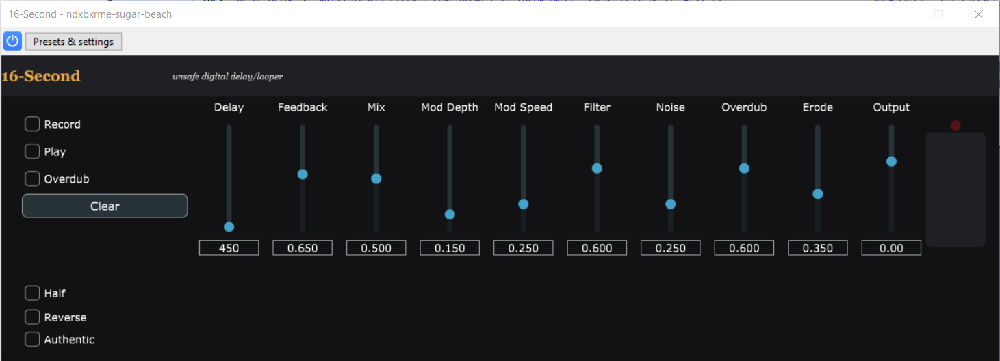

# 16-Second (VST3)
[](https://github.com/ndxbxrme/16-second/actions/workflows/ci.yml)
[](https://github.com/ndxbxrme/16-second/releases)



Experimental VST3 inspired by the Electro-Harmonix 16-Second Digital Delay. The focus is on the behavioral feel (unsafe time changes, destructive overdub, evolving feedback), not a circuit-perfect emulation.

## Status
- Milestone 7: modulation LFO (Mod Depth/Speed) integrated into delay time.
- Starter presets available via host preset menu.

## Releases
- Latest builds:
  - Windows: https://github.com/ndxbxrme/16-second/releases/latest/download/16-Second-windows-vst3.zip
  - Linux: https://github.com/ndxbxrme/16-second/releases/latest/download/16-Second-linux-vst3.zip
  - macOS: https://github.com/ndxbxrme/16-second/releases/latest/download/16-Second-macos-vst3.zip

## Build (Linux/WSL)
Dependencies (Ubuntu/Debian):
```
sudo apt-get update
sudo apt-get install -y \
  cmake pkg-config \
  libx11-dev libxext-dev libxinerama-dev libxrandr-dev libxcursor-dev libxi-dev \
  libxcomposite-dev libxdamage-dev libxfixes-dev libxrender-dev libxss-dev \
  libxkbcommon-dev libxkbcommon-x11-dev \
  libfreetype6-dev libasound2-dev libcurl4-openssl-dev
```

Configure and build:
```
cmake -S . -B build_juce6
cmake --build build_juce6
```

Run tests:
```
cd build_juce6
ctest -V
```

## Build (Windows, VST3 for Audacity)
You must build on Windows to produce a Windows `.vst3` bundle. The Linux `.so` from WSL will not load in Windows Audacity.

Prereqs:
- Visual Studio 2022 with the C++ workload
- CMake (3.16+)

Configure and build (PowerShell, repo root):
```
cmake --preset win-release
cmake --build --preset win-release
```

Copy the plugin to your VST3 folder:
```
PowerShell -ExecutionPolicy Bypass -File .\scripts\copy_vst3_windows.ps1 -BuildDir build_win -Vst3Dir "C:\Program Files\Common Files\VST3"
```

Then in Audacity:
- Rescan plugins, enable “16-Second”

## Scripts
If you have npm installed, convenience scripts exist:
```
npm run configure
npm run build
npm run ctest
```

## Docs
- Spec: `docs/SPEC.md`
- Usage: `docs/USAGE.md`
- Changelog: `docs/CHANGELOG.md`

## Notes
- We pin JUCE 6.1.6 for CMake 3.16 compatibility.
- AU/Standalone targets are not enabled yet.
